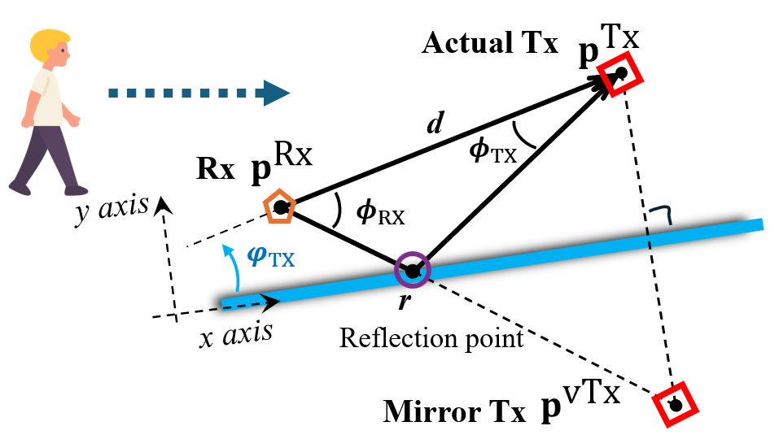
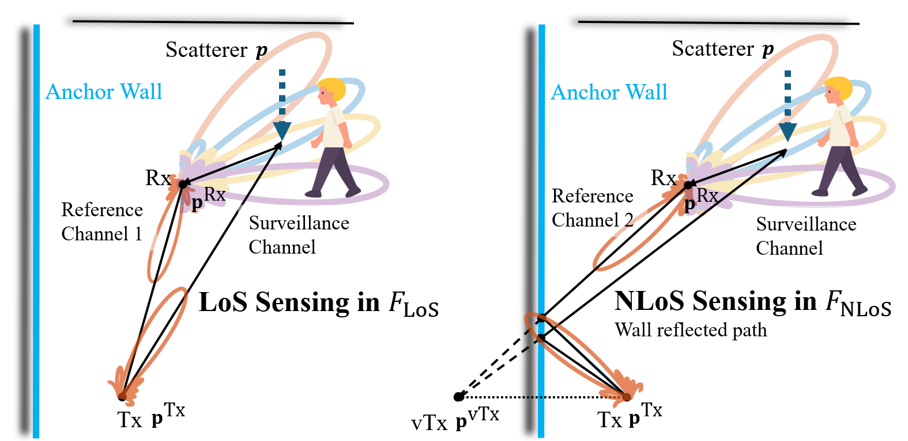
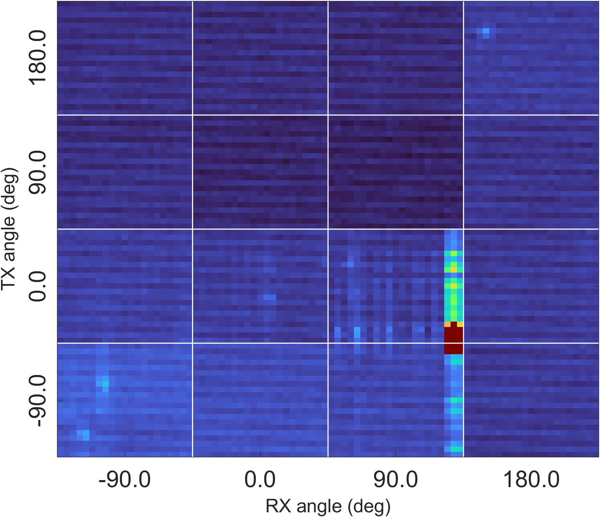
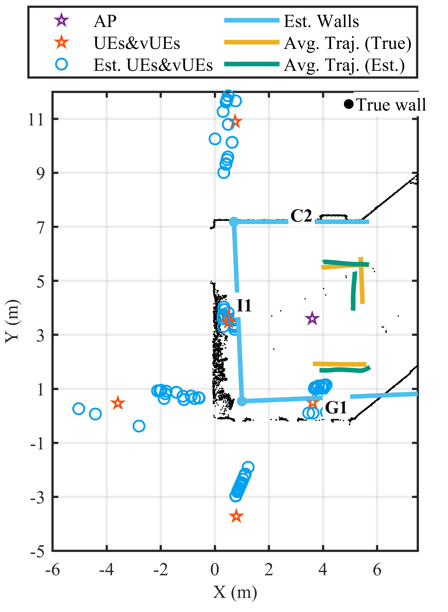

# DopMap

**Doppler-Driven Indoor Mapping via mmWave Communication Signals**

DopMap reconstructs an indoor wall layout from millimeter-wave communication links. It uses the bistatic Doppler signatures produced by a moving scatterer to establish one **anchor wall**, then reuses beam-pair angle measurements to extend the map to other walls. The method does not rely on wideband time-of-flight ranging or timing synchronization between the transmitter and receiver.

## Why map with communication signals?

Narrow beams are essential for mmWave links, but an indoor link may be blocked while useful reflected paths remain. A map of wall directions and likely LoS/NLoS paths could help rank candidate beam pairs and prepare alternate paths. This is a **potential application** to indoor mmWave beam establishment, including IMMW scenarios; DopMap is not a specified IEEE 802.11bq feature. Actual beam measurements are still needed to confirm a usable link.

## Stage 1 — Find an anchor wall from two Doppler views

The same moving scatterer is observed through a LoS sensing link and a wall-reflected NLoS sensing link. By the mirror principle, the latter behaves geometrically like a link from a mirror transmitter. The receiver tracks the scatterer's AoA and the two bistatic Doppler frequencies over a short interval, jointly estimating its trajectory and the real and mirror transmitter positions.

The central measurement relation is the bistatic Doppler shift. For each link $m\in\{1,2\}$ and observation time $k$,

$$
f_{m,k}=\frac{1}{\lambda_m}\left(\frac{\mathbf p_m^{\mathrm{Tx}}-\mathbf p_k}{\|\mathbf p_m^{\mathrm{Tx}}-\mathbf p_k\|}+\frac{\mathbf p^{\mathrm{Rx}}-\mathbf p_k}{\|\mathbf p^{\mathrm{Rx}}-\mathbf p_k\|}\right)^{\!\mathrm T}\mathbf v_k.
$$

Here $\mathbf p_k$ and $\mathbf v_k$ are the moving scatterer's position and velocity, $\mathbf p^{\mathrm{Rx}}$ is the receiver position, and $\mathbf p_m^{\mathrm{Tx}}$ is the real transmitter for the LoS link or its mirror for the reflected link. $\lambda_m$ is the carrier wavelength. Once the two transmitter positions have been recovered, **their perpendicular bisector gives the anchor wall**. The AoA/AoD measurements from beam alignment fix its distance and orientation relative to the receiver.

## Stage 2 — Complete the layout from beam pairs

Beam alignment supplies AoD/AoA pairs for the LoS path and wall-reflected NLoS paths. The known anchor wall first constrains each transmitter's position. Each remaining NLoS pair then gives a reflection geometry and a candidate wall. In the paper's angle convention, a candidate wall's inward unit normal is

$$
\hat{\mathbf n}_{i,n}=-\frac{\mathbf u(\hat\theta^{(n)}_{\mathrm{Rx},i})+\mathbf u(\hat\theta^{(n)}_{\mathrm{Tx},i})}{\left\|\mathbf u(\hat\theta^{(n)}_{\mathrm{Rx},i})+\mathbf u(\hat\theta^{(n)}_{\mathrm{Tx},i})\right\|_2},
$$

where $i$ indexes transmitter positions, $n$ indexes reflected paths, and $\mathbf u(\theta)$ is a unit vector at angle $\theta$. Intersecting the AoA and AoD rays gives the reflection point $\mathbf r_{i,n}$; the wall distance from the receiver follows from

$$
\hat d^{\mathrm{Rx}}_{i,n}=\left|\hat{\mathbf n}_{i,n}^{\mathrm T}(\mathbf p^{\mathrm{Rx}}-\mathbf r_{i,n})\right|.
$$

Estimates from several transmitter positions are clustered in wall angle–distance space, reducing the effect of angle error and isolated false detections. This stage uses beam-pair measurements and does not require continued tracking of the moving scatterer.

Example beam-pair power map

The bright peaks correspond to strong transmitter/receiver beam combinations used to identify propagation paths.

## Experimental snapshots

The presentation compares a setting with relatively strong wall reflections and one with weaker or irregular reflections, including glass and display surfaces. Blue segments in the maps are estimated walls; black points show measured wall contours.

| Stronger reflections | Weaker / irregular reflections |
| :---: | :---: |
|  |  |

Increasing the number of transmitter positions from one to four makes the completed layout more consistent and suppresses a false wall candidate:

In the reported experiments, the **90th-percentile** anchor-wall distance error was **1.22 m**, and the **90th-percentile** moving-scatterer trajectory error was **0.88 m**. With four transmitter positions, the **mean distance error for the additional walls** was **0.29 m**; wall-direction errors were mostly within **4°**. These numbers describe different stages and error statistics.

## Project scope

This repository is a visual research overview: README and presentation figures only. It does not contain the implementation or measurement data.
