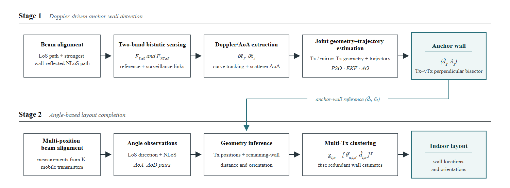
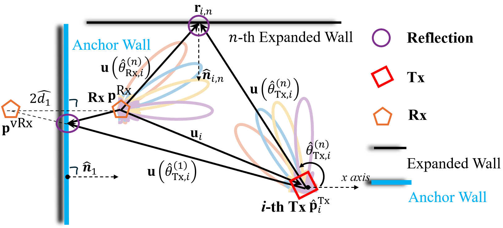
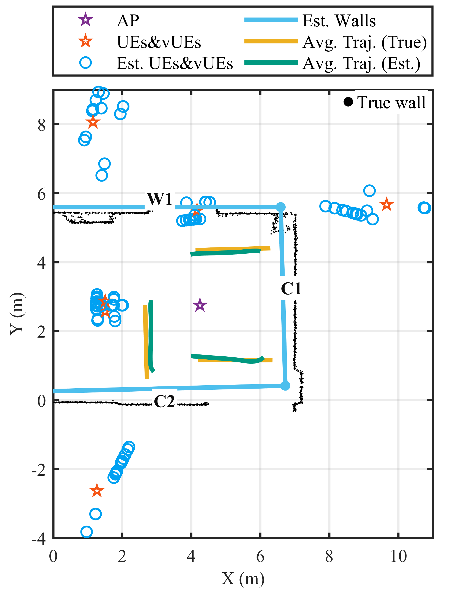
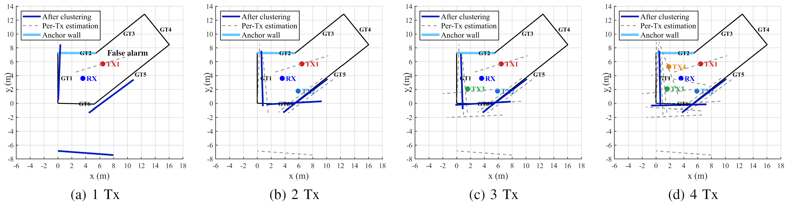
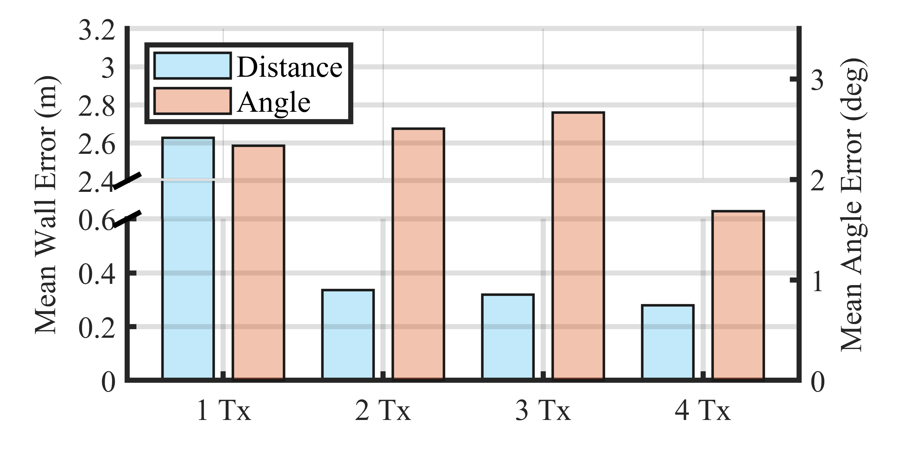

## Overview

Indoor wall geometry supports navigation, spatial sensing, and the interpretation of millimeter-wave (mmWave) propagation. Conventional mapping commonly uses cameras, LiDAR, or radar, while communication-based approaches often depend on wideband delay measurements or synchronized transmitter and receiver clocks. DopMap investigates whether an uplink mmWave communication system can recover a wall layout from measurements already available during beam alignment and passive sensing. A moving scatterer intersects a line-of-sight (LoS) path and a wall-reflected non-line-of-sight (NLoS) path, producing distinct bistatic Doppler signatures. DopMap combines these signatures with angle-of-arrival (AoA) observations to estimate the transmitter, its mirror image, and an initial anchor wall. Subsequent angle-of-departure (AoD) and AoA measurements extend the reconstruction to other walls, with observations from multiple transmitter positions reducing geometric error. The method does not require direct time-of-flight ranging or timing synchronization between the transmitter and receiver. The resulting map may provide geometric context for future mmWave link planning, subject to confirmation by live beam measurements.

## Target Scenarios

DopMap targets indoor spaces with a fixed mmWave receiver and one or more transmitter positions. A moving person or object provides the Doppler diversity needed to infer the first wall; the moving scatterer is an opportunistic geometric probe rather than the final mapping target. The LoS and wall-reflected NLoS paths are observed in separate frequency bands through reference and surveillance beams. Once the anchor wall is known, additional wall candidates are inferred from beam-pair angles without continued tracking of the scatterer.

*Figure 1: A moving scatterer is observed through LoS and anchor-wall-reflected NLoS sensing links in separate frequency bands.*

The evaluation covers a $5\,\mathrm{m}\times5\,\mathrm{m}$ corridor-like space with concrete walls and a wooden door, and an $8\,\mathrm{m}\times6\,\mathrm{m}$ open hall containing concrete, glass, and a trophy cabinet with irregular reflective objects. These settings test both strong specular returns and weaker or less regular reflections. Transmitter and receiver units were placed at a height of $1.5\,\mathrm{m}$.

## System Architecture

The system has two stages: Doppler-driven anchor-wall detection and angle-based layout completion. Beam alignment identifies a LoS path and a dominant wall-reflected path. In the first stage, two transmitter RF chains operate in separate narrow frequency bands, while the receiver uses two reference beams and a scanning surveillance beam. Reference–surveillance processing extracts the moving scatterer's Doppler shift; using a reference measured at the same receiver also removes the common carrier-frequency offset from each sensing pair. AoA estimates associate Doppler observations with the scatterer's direction.

*Figure 2: DopMap uses beam alignment, two-band bistatic sensing, joint geometry–trajectory estimation, and multi-position angular measurements to reconstruct the wall layout.*

For a scatterer at position $\mathbf p_k$ with velocity $\mathbf v_k$, the bistatic Doppler measurement for path $m$ is

$$
f_{m,k}=\frac{1}{\lambda_m}\left(\frac{\mathbf p_m^{\mathrm{Tx}}-\mathbf p_k}{\|\mathbf p_m^{\mathrm{Tx}}-\mathbf p_k\|}+\frac{\mathbf p^{\mathrm{Rx}}-\mathbf p_k}{\|\mathbf p^{\mathrm{Rx}}-\mathbf p_k\|}\right)^{\!\mathrm T}\mathbf v_k.
$$

Here $\mathbf p_m^{\mathrm{Tx}}$ is the physical transmitter for the LoS link and the mirror transmitter for the reflected link. Joint fitting of the two Doppler tracks and the scatterer AoAs estimates these transmitter positions together with the short scatterer trajectory. The anchor wall lies on the perpendicular bisector between the physical and mirror transmitter positions.

*Figure 3: The physical transmitter and its mirror image constrain the location and orientation of the anchor wall.*

In the second stage, AoD–AoA pairs from LoS and reflected paths constrain the transmitter position and reflection points relative to the anchor wall. Each reflected path produces a candidate wall distance and direction. DopMap clusters candidates from several transmitter positions in angle–distance space to suppress isolated false detections and complete the indoor contour.

*Figure 4: AoD–AoA rays and the anchor-wall reference constrain the reflection point and a candidate additional wall.*

## Experimental Evaluation

The prototype uses mmWave phased arrays and software-defined radios with separate transmitter and receiver clocks. LiDAR room contours and TurtleBot odometry provide evaluation ground truth; they are not inputs to DopMap's wall estimator.

| Testbed component | Experimental specification |
| :--- | :--- |
| Baseband radios | National Instruments USRP-2954R at the transmitter and receiver |
| mmWave front ends | Two Sivers BFM06005 phased arrays at the transmitter; three at the receiver |
| Transmit signals | $60.97$ and $60.98\,\mathrm{GHz}$, each with $0.5\,\mathrm{MHz}$ bandwidth |
| Receiver channels | Two $0.5\,\mathrm{MHz}$ reference channels and one $2\,\mathrm{MHz}$ surveillance channel for anchor-wall detection |
| Ground truth | Livox MID-360 LiDAR wall contours and TurtleBot 4 odometry with a $1.70\,\mathrm{m}$ reflector |

Across six tested reflecting surfaces, anchor-wall detection used 16 scatterer trajectories per surface. The $90$th-percentile anchor-wall distance error was about $0.78\,\mathrm{m}$ in the stronger-reflection environment and $1.22\,\mathrm{m}$ in the more difficult environment. The corresponding $90$th-percentile trajectory errors were $0.46\,\mathrm{m}$ and $0.88\,\mathrm{m}$. Most reported wall-direction errors remained within $4^\circ$.

*Figure 5: Example anchor-wall and scatterer-trajectory reconstruction; blue wall segments are estimates and black points indicate LiDAR-measured contours.*

For layout completion in the open hall, estimates from one to four transmitter positions were combined. A single-position estimate of one additional wall had a $2.63\,\mathrm{m}$ wall–receiver distance error; with four positions and clustering, the mean distance error over the additional walls was $0.29\,\mathrm{m}$. The separate Doppler-extraction evaluation reported a $24.02\%$ reduction in average detection error relative to conventional CFAR processing.

*Figure 6: Additional wall estimates become more consistent as beam-pair measurements from one to four transmitter positions are combined.*

*Figure 7: Mean wall–receiver distance and wall-direction errors for angle-based layout completion with one to four transmitter positions.*

* **Anchor-Wall Detection**: The $90$th-percentile wall–receiver distance error was $1.22\,\mathrm{m}$ in the weaker-reflection environment.
* **Layout Completion**: Four transmitter positions yielded a $0.29\,\mathrm{m}$ mean distance error for the additional walls.
* **Doppler Extraction**: Average Doppler detection error decreased by $24.02\%$ relative to the CFAR baseline.
